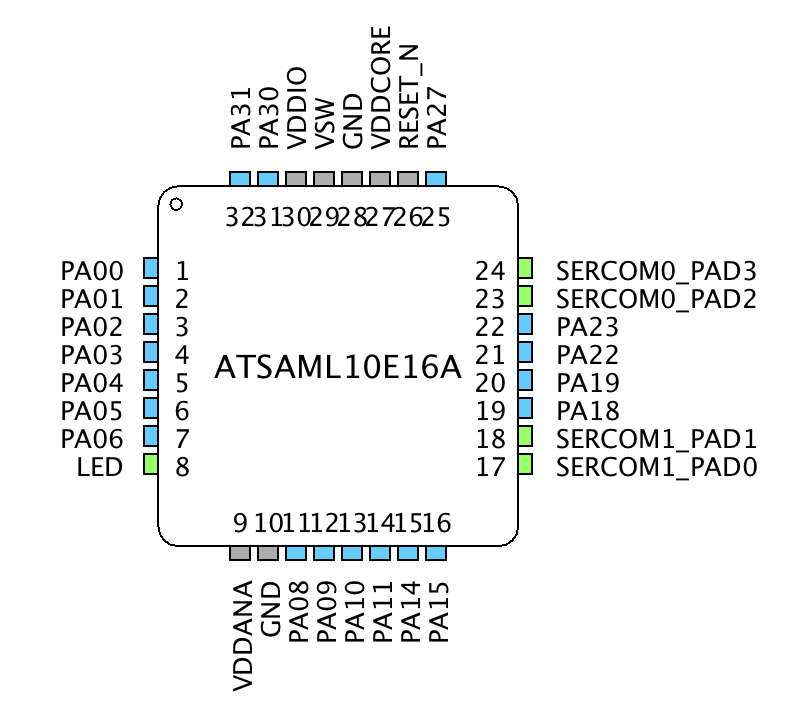

# USAGE

## MPLABX

### Load Project

File -> Open Project

Master

`./MPLABX/ATMEL_SAM_D21_I2C_Master/firmware/ATMEL_SAM_D21_I2C_Master.X`

Slave

`./MPLABX/ATMEL_SAM_L10_I2C_Master/firmware/ATMEL_SAM_L10_I2C_Master.X`

## MPLAB® Harmony Configurator v3

### Launch MHC

Tools -> Embedded -> MPLAB@ Harmony 3 Configurator

Harmony 3 Configuratorが正しく読み込まれていれば, 以下のような画面が現れる.

Master

Slave

各Periheralをクリックすると右側に設定画面が現れるので, 各自設定していく.

### Save MHC

MHC -> Save Configuration

### Close MHC

MHC -> Exit

### Generate Code

MHC -> Generate Code

## Master Settings

### System Settings

Default

### Clock Settings

Default

### DMA Settings

Default

### Pin Settings

ピンの設定を行う.

MHC -> MHC -> Pin Configuration

PackageをQFN64からTQFP64に変更する.

以下のピン設定を行う. 設定を変更するピンのみ記載. (-：設定不可)

|No.|Pin ID|Custom Name    |Function       |Mode    |Direction|Latch|Pull Up|Pull Down|Drive Strength|
|:--|:--   |:--            |:--            |:--     |:--      |:--  |:--    |:--      |:--           |
|17 |PA08  |               |SERCOM2_PAD0   |Digital |-        |-    |-      |-        |-             |
|18 |PA09  |               |SERCOM2_PAD1   |Digital |-        |-    |-      |-        |-             |
|43 |PA22  |               |SERCOM3_PAD0   |Digital |-        |-    |-      |-        |-             |
|44 |PA23  |               |SERCOM3_PAD1   |Digital |-        |-    |-      |-        |-             |
|59 |PB30  |LED            |GPIO           |-       |Out      |-    |-      |-        |-             |

設定後のピンの状態

### SERCOM2(as I2C) Settings

Available Components -> Periherals -> SERCOM -> SERCOM2を選択.

SERCOM2を以下のように設定する.

### SERCOM0(as UART) Settings

Available Components -> Periherals -> SERCOM -> SERCOM3を選択.

SERCOM3を以下のように設定する.

### SERCOM printf

Available Components -> Tools-> STDIOを選択.

printfのputc, getcをSERCOM3にリダイレクトするように設定する.

SERCOM3とSTDIOのUARTピンをそれぞれ接続する.

## Slave Settings

### System Settings

Default

### Clock Settings

Default

### DMA Settings

Default

### Pin Settings

ピンの設定を行う.

MHC -> MHC -> Pin Configuration

PackageをQFN64からTQFP64に変更する.

以下のピン設定を行う. 設定を変更するピンのみ記載. (-：設定不可)

|No.|Pin ID|Custom Name    |Function       |Mode    |Direction|Latch|Pull Up|Pull Down|Drive Strength|
|:--|:--   |:--            |:--            |:--     |:--      |:--  |:--    |:--      |:--           |
|8  |PA07  |LED            |GPIO           |Digital |Out      |-    |-      |-        |-             |
|17 |PA16  |               |SERCOM1_PAD0   |Digital |-        |-    |-      |-        |-             |
|18 |PA17  |               |SERCOM1_PAD1   |Digital |-        |-    |-      |-        |-             |
|23 |PA24  |               |SERCOM0_PAD2   |Digital |-        |-    |-      |-        |-             |
|24 |PA25  |               |SERCOM0_PAD3   |Digital |-        |-    |-      |-        |-             |

設定後のピンの状態

### SERCOM1(as I2C) Settings

Available Components -> Periherals -> SERCO1 -> SERCOM1を選択.

SERCOM1を以下のように設定する.

### SERCOM0(as UART) Settings

Available Components -> Periherals -> SERCOM -> SERCOM0を選択.

SERCOM0を以下のように設定する.

### SERCOM printf

Available Components -> Tools-> STDIOを選択.

printfのputc, getcをSERCOM0にリダイレクトするように設定する.

SERCOM0とSTDIOのUARTピンをそれぞれ接続する.

## Main

MHC3でコード生成されるmainファイルをNo.0とする. 以降, 機能を追加していくたびにmainファイルを別で生成する.

デバッグの際は, mainファイルを切り替えて使用する. 基本的には上から順に動作確認することを前提とする.

|No.|Master Program File                                                                            |Slave Program File                                                                           |Description                                      |
|:--|:--                                                                                            |:--                                                                                          |:--                                              |
|0  |[main.c](MPLABX/ATMEL_SAM_D21_I2C_Master/firmware/src/main.c)                                  |[main.c](MPLABX/ATMEL_SAM_L10_I2C_Slave/firmware/src/main.c)                                 |Default                                          |
|1  |[main_i2c_master_map1.c](MPLABX/ATMEL_SAM_D21_I2C_Master/firmware/src/main_i2c_master_map1.c)  |[main_i2c_slave_map1.c](MPLABX/ATMEL_SAM_L10_I2C_Slave/firmware/src/main_i2c_slave_map1.c)   |EEPROM Address:1Byte,  Size:256Bytes             |
|2  |[main_i2c_master_map2.c](MPLABX/ATMEL_SAM_D21_I2C_Master/firmware/src/main_i2c_master_map1.c)  |[main_i2c_slave_map2.c](MPLABX/ATMEL_SAM_L10_I2C_Slave/firmware/src/main_i2c_slave_map2.c)   |EEPROM Address:2Bytes, Size:512Bytes             |
|2  |[main_i2c_master_app.c](MPLABX/ATMEL_SAM_D21_I2C_Master/firmware/src/main_i2c_master_app.c)    |[main_i2c_slave_app.c](MPLABX/ATMEL_SAM_L10_I2C_Slave/firmware/src/main_i2c_slave_app.c)     |App Version EEPROM Address:1Bytes, Size:256Bytes |

### No.1

SlaveにAddress Size: 1Byte, Memory Size: 256BytesのEEPROMをシミュレーションする.

Masterからは, まず先頭の4Byteに"MHCP"とWriteし, 次に先頭から4Byte Readし, その結果をSerialで出力する. 正しく動作するとLEDが点灯し, Terminalに送信データと受信データの結果が表示される.

### No.2

SlaveにAddress Size: 2Byte, Memory Size: 512BytesのEEPROMをシミュレーションする.

Masterからは, まず先頭の4Byteに"MHCP"とWriteし, 次に先頭から4Byte Readし, その結果をSerialで出力する. 正しく動作するとLEDが点灯し, Terminalに送信データと受信データの結果が表示される.

No.1と結果は同じ.

### No.3

No.3はNo.1をAppにしたもの. MasterプロジェクトのSource Filesに`i2cApp.c`, Header Filesに`i2cApp.h`を追加する. SlaveプロジェクトのSource Filesに`eepromEmu.c`, Header Filesに`eepromEmu.h`を追加する.
